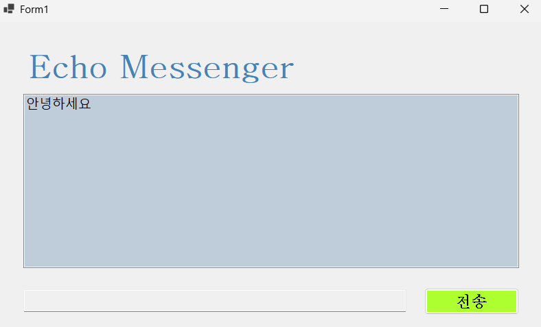
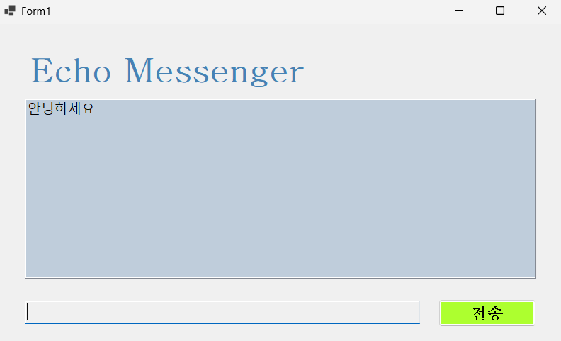
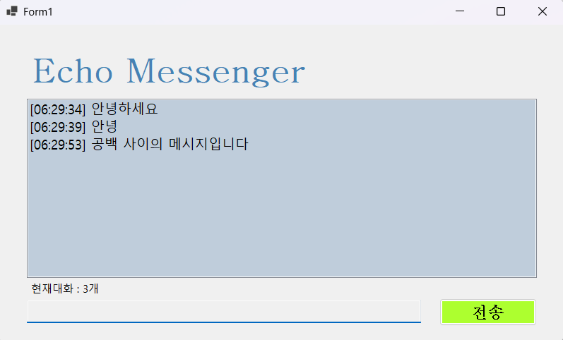

# (C# 코딩) 에코 메신저
## 개요
- C# 프로그래밍 학습
- 핵심기능: 전송 버튼을 누르면 TextBox에 입력된 내용을 ListBox에 저장하고 TextBox의 내용을 지움, 전송이 끝나면 다시 TextBox에 Focus, Enter 키를 눌러 전송을 수행할 수 있음 
- 화면구성: 중앙에 입력한 텍스트를 저장하는 ListBox, 입력을 받는 TextBox, 전송을 담당하는 Button, Echo Messenger 제목을 표시하는 Label
## 실행 화면
- 1단계 코드의 실행 스크린샷

- 과제 내용
 - Label(제목), ListBox(결과), TextBox(입력), Button(전송) 추가
 - 전송 버튼 클릭 시 TextBox의 입력한 내용을 ListBox의 Items로 추가
 - 추가 직후 TextBox의 내용을 Clear
- 구현 내용과 기능 설명
 - TextBox에 내용을 입력하고 전송 Button을 누르면 ListBox에 입력한 내용을 저장
 - 전송 후 TextBox의 내용을 비워 추가 입력을 대기
- 2단계 코드의 실행 스크린샷

- 과제 내용
 - 전송을 Enter 키로 수행
 - 전송 이후 다시 TextBox에 Focus
 - 전송 내용이 공백인 경우 전송하지 않음
- 구현 내용과 기능 설명
 - Enter 키를 누르면 전송 버튼을 눌렀을 때의 코드를 실행
 - 전송 코드에 TextBox에 Focus하도록 변경
 - 전송 내용이 아무것도 없는 공백일 경우 해당 내용을 전송하지 않음
- 3단계 코드의 실행 스크린샷

- 과제 내용
 - 메시지 앞에 현재 시간을 추가
 - 현재 메시지의 수를 볼 수 있는 텍스트 추가
 - 메시지의 앞 뒤의 불필요한 공백을 없애는 기능 추가
- 구현 내용과 기능 설명
 - 메시지를 입력하면 메시지 앞에 [시간:분:초] 형식으로 현재 시각을 추가해 입력됨
 - 새로운 라벨을 하나 생성하고 그 라벨의 현재 리스트박스의 아이템들의 수를 반영하여 입력함
 - 입력한 메시지에서 앞 뒤의 불필요한 공백이 있으면 이를 제거한 문자열을 저장해 그 문자열을 결과로 사용함
- 4단계 코드의 실행 스크린샷
(여기에 이미지 삽입)
## 배운 내용
- 컨트롤의 좌표를 계산하는 것이 어려웠지만, ...
- 인터넷 연결은 Coilot의 도움을 받아 ...